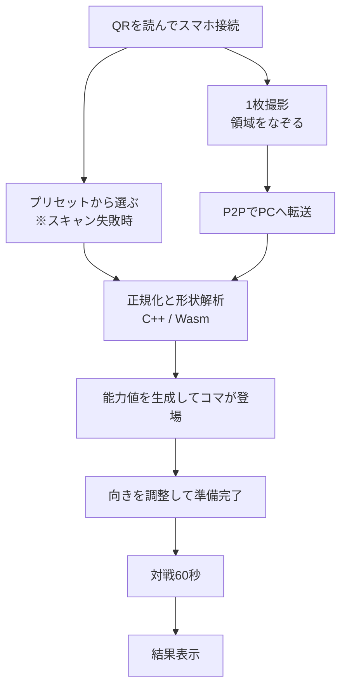

# 企画書：実物スキャン対戦ゲーム

## 概要
身の回りのものをスマホでスキャンして3D化し、スキャンしたものを戦わせるゲーム。

消しゴム、マグカップ、ぬいぐるみ、手元にある物をスキャンすると、その形から自動で能力値が生成され、その場で戦える。

[特徴]
- 自分の持ち物が画面の中に現れる
- 形が強さに直結する
- スマホを傾けて操作する

PC画面のQRコードを読むことで参加

## 背景
課題：実物が画面に入ってくるという体験は、専用アプリか高価な機材を必要とすることが多い。
解決：ブラウザ内で完結させて、手元にある物が1分後には対戦のコマになっている状態を作りたい

## スキャンの方式
スマホで撮った写真から、輪郭を押し出して疑似3Dメッシュを作る。

 
## ゲームサイクル
 

1試合は60秒とし、接続から結果発表まで5分以内に収める。

60秒にした理由
- 攻撃が2種類しかないため、試合時間を長くしすぎるとマンネリ化する
- 発表用のデモ動画に試合をノーカットで丸ごと入れられる

## 発表の構成(仮)
オンライン発表が3分であるとき
| 尺 | 内容 |
|---|---|
| 0:00–0:30 | 導入と課題 |
| 0:30–2:00 | デモ動画（90秒） |
| 2:00–2:45 | 技術的な話（構成とか） |
| 2:45–3:00 | まとめ |

## デモ動画の撮影
 
| 系統 | 内容 | 役割 |
|---|---|---|
| 外部カメラ（3台目） | プレイヤー2人とPC画面が同じフレームに入る引きの画 | **スマホで操作していることを示す唯一の手段** |
| 画面収録 | PC画面をそのまま録画 | 試合の細部と演出を見せる |

- 試合中は画面収録を主とし、外部カメラを小さくワイプで重ねる(？)
- スマホを操作している手元が見えるようにする
- 音は画面収録側から取る

### 関連文書
- spec.md
- tecnical.md