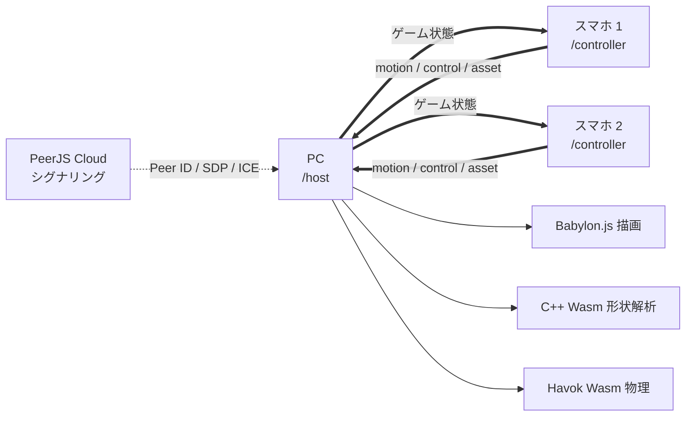

# 技術計画書

## 着手順
 
**壊れたら企画が終わる順**に潰す。
 
1. C++ → Wasm が通るか
2. iOS実機でセンサー許可が通るか
3. P2Pが繋がるか
4. Babylon ＋ Havok が動くか
1と2がダメなら企画を見直すべき(？)。3と4には代替がある。

## 1. システム構成
 
```
Vercel
└─ Vite SPA
   ├─ /host        PC用ロビー・ゲーム画面
   └─ /controller  スマホ用スキャン・操作画面
 
PeerJS Cloud
└─ Peer ID、SDP、ICE candidate の交換だけ
 
PCホスト
├═ motion / control / asset ═ スマホ1
└═ motion / control / asset ═ スマホ2
```
 


## 2. 技術選定
 
| 層 | 採用 | 理由 |
|---|---|---|
| Web基盤 | Vite＋React＋TypeScript | PC版とスマホ版を同一SPAの別ルートで出せる |
| 3D基盤 | Babylon.js＋Havok Wasm | 物理・演出・Inspector が統合済み |
| 形状解析 | C++＋Emscripten / Embind | 2D凸包・慣性テンソル・主軸。**自前実装の中核** |
| 写真の領域分割 | MediaPipe Interactive Segmenter | Wasm上で動き、ユーザー指定領域からマスクを作れる |
| 通信 | PeerJS＋公開PeerServer | P2Pで低遅延。シグナリングを自前運用しない |
| ホスティング | Vercel | HTTPSが初めから付く（センサーAPIの必須条件） |
 
**Babylon.js を選んだ理由** — three.js より構成が大きく、React Three Fiber の宣言的な記述は使えない。一方で本作は物理・演出・Inspector をすべて使うため、個別統合を減らせる利点が上回る。初期版は WebGL 2、WebGPU は後回し。
 
## 3. パッケージ構成
 
```
packages/
├── web/            Vite + React + TS（/host と /controller）
├── protocol/       通信型、Zodスキーマ、プロトコルバージョン
└── geometry-wasm/  C++ → Emscripten
```
 
UI状態は React、Babylon.js のゲームループと物理状態は React の外。Babylon.js と MediaPipe は必要な画面だけ遅延読み込み。
 
**着手前に `protocol` と `geometry-wasm` の型を確定させる。** ここさえ決まれば3人が別々に進められる。

## 4. C++ / Wasm API
 
```ts
type GeometryInput = {
  positions: Float32Array
  indices: Uint32Array
  source: "photo" | "preset"
}
 
type GeometryResult = {
  hullPositions: Float32Array
  hullIndices: Uint32Array
  centerOfMass: [number, number, number]
  inertia: [number, number, number]
  axes: { elongation: number; solidity: number; sharpness: number }
  stats: FighterStats
}
 
type FighterStats = {
  hp: number          // 80 〜 140
  attack: number      // 0.80 〜 1.30
  reach: number       // 0.85 〜 1.25
  turnSpeed: number   // 240 〜 120 度/秒
  moveSpeed: number   // 1.25 〜 0.80
}
```
## 5. 通信設計
 
### ペアリング
 
1. PCが Peer ID を取得する
2. Player 1 / 2 用に128bitのトークンを生成する
3. `hostPeerId`・スロット・トークンを QR に埋める
4. スマホは接続時の metadata にスロットとトークンを付ける
5. PCが検証し、使用済み・重複を拒否する
6. 接続後は PeerServer から切れても P2P は維持される
### 3本のチャネル
 
| label | reliable | 用途 |
|---|---|---|
| `motion` | false | 30Hzの傾き |
| `control` | **true** | 攻撃、決定、準備完了、振動指示 |
| `asset` | **true** | 写真、マスク、解析結果 |
 
傾きは**欠損しても再送しない**（`ordered: false`, `maxRetransmits: 0`）。一つ前の傾きはもう古いので、待つより捨てたほうが滑らか。
 
逆に**ボタンは確実に届ける**。攻撃が抜けるとゲームが壊れる。
 
傾きはそのまま使わず、**PC側で補間してから**物理ステップへ入れる。生値だとカクつく。
 
### アセット転送
 
運ぶのは写真1枚とマスクのみ。長辺2048px、JPEGで 0.5〜1.5MB。
 
```ts
type AssetManifest = {
  transferId: string
  mode: "photo"
  fileName: string
  mimeType: string
  byteLength: number
  sha256: string
  chunkCount: number
}
```
 
- 12KiB単位の ArrayBuffer へ分割
- `asset` 接続のバッファー量を監視し、詰まったら待つ
- PC側で進捗を表示、再結合後に SHA-256 を検証
- 中断時は全体を再開。部分再送は初期版に含めない
## 6. 留意点
 
### 6.1 P2P通信
 
**リスク**
 
- 対称NAT同士だと STUN では穴あけに失敗し、TURN が必要になる
- 公開TURNは帯域制限があるか信頼できない
- 学内Wi-Fiなど端末間通信を遮断している回線では、同じSSIDでも繋がらない
- 開発中は3人が別々のネットワークにいるので環境差が出る
**対策**
 
- 発表はオンラインで、PCもスマホ2台も手元に置ける。**本番のネットワークは完全に固定できる**
- それでもテザリングを予備に用意しておく
- 接続状態をPC画面に常時表示し、失敗時はリトライとQR再表示
- 開発中は3人それぞれの環境で接続テストを回す
**自前PeerServerは対象外。ただし保険は把握しておく** — Vercel Functions は WebSocket に対応しているので、同じプロジェクトに PeerServer を置くことは可能。接続は Function の最大実行時間で切れるが、**本計画はペアリング後に PeerServer から切断する設計**なので相性がよい。**緊急時の保険であり、スコープには含めない。**
 
### 6.2 センサー
 
```js
// 必ずボタンの onClick の中で呼ぶ
const p = await DeviceOrientationEvent.requestPermission()
if (p === 'granted') window.addEventListener('deviceorientation', handler)
```
 
**HTTPS が必須。** localhost 以外の非HTTPSでは動かないので、実機確認は Vercel に常時デプロイする。**初日に通しておく。**
 
**座標系**
 
| 問題 | 対策 |
|---|---|
| 持ち方で軸が変わる | 「まっすぐ持って開始」で基準姿勢を取り、差分で扱う |
| alpha がドリフトする | 絶対方位は使わない。beta / gamma だけ |
| 真上・真下で値が暴れる | 有効範囲を ±60度にクランプ |
| Android と iOS で符号が違う | 両OSの実機で早めに確認 |
 
傾きの処理は軸のクランプとローパスだけなので**素直にJSで書く**。Wasm化すると不自然さを突っ込まれる。
 
### 6.3 スキャンと形状
 
**能力値** — 当初の算出式では5能力値が実質2次元に潰れることが判明。3軸設計で解決済み（[04](./04-validation-shape-stats.md)）。
 
**輪郭の単純化** — 実マスク由来の輪郭は階段状で、**RDP 0.2% を入れないと軸C（鋭さ）が壊れる**（[05](./05-mesh-pipeline-issues.md) I-1）。
 
**スキャンが失敗する物がある** — 背景と同系色、透明、細かい毛。暗い場所もダメ。**プリセットコマを代替手段として用意する**（仕様書 7.5 節）。
 
**MediaPipe の初回ロード** — Wasm とモデルで数MB。**コントローラー画面の初期化時点でプリロードする。** ユーザーが構図を決めている間に終わる。
 
**写真サイズ** — スマホのカメラは4000px超を出す。Canvas で長辺2048pxにリサイズしてから JPEG 化する。
 
## 7. 受け入れ条件
 
- [ ] **能力値が十分にばらつく**（日用品10個で検証。最優先）
- [ ] 同じメッシュから常に同じ能力値と凸包が生成される
- [ ] 穴、重複頂点、**自己交差**を含む入力でクラッシュしない
- [ ] スキャンに失敗してもプリセットコマで試合を開始できる
- [ ] **両者が逃げに徹しても60秒以内に決着する**
- [ ] QR読み取りから15秒以内に接続できる
- [ ] 入力からPC描画までの p95 が 100ms 以下
- [ ] 接続から対戦終了までを5分以内に通せる
- [ ] 写真を進捗表示付きで転送し、操作接続を止めない
- [ ] リング縮小の予告と、体当たり中の予備動作が見て分かる
- [ ] 中程度のPCで60fpsを維持する
- [ ] Android Chrome で振動し、iPhone Safari で代替演出が動く
- [ ] PeerJS Cloud を切った後も対戦を完了できる
- [ ] Android Chrome、iPhone Safari、PC版 Chrome / Edge / Safari で実機確認
## 8. 将来拡張
 
**実3Dモード** — Polycam / Scaniverse の GLB 読み込み。初期版に含めない理由は仕様書 7.6 節。追加時は 3D凸包（QuickHull）、10MBのチャンク転送、モード選択UIが要る。
 
**同一LAN・複数PC** — `screen` 役割の接続を追加し、最初のPCを権威ホストにして20Hzで状態をミラーする。スマホはホストPCへ直接接続のまま。
 
**別LAN・複数PC** — 認証付きTURNを追加。観戦者が増えたら PeerServer を自前運用し、必要なら LiveKit へ。通信層を `RealtimeTransport` で分離しておけば、ゲームロジックを変えずに移行できる

